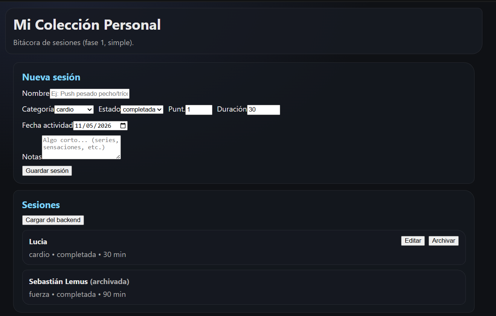

# Mi Colección Personal (Gym)

Proyecto universitario (React + Express) para llevar una bitácora de sesiones de entrenamiento.

Elegí este tema porque entreno casi todas las semanas y siempre termino apuntando cosas sueltas (en notas del cel o en papel). La idea acá es tener un lugar sencillo para registrar lo que hice y cómo me sentí.

## Qué hace (Fase 1)

- CRUD básico de sesiones: crear, editar y archivar.
- Guarda en **LocalStorage** para no perderlo si cierro el navegador.
- También guarda en el **backend** (Express + Postgres) usando `fetch`.
- No hay login, no hay cosas avanzadas todavía.

## Mis primeras sesiones (ejemplos reales)

- Push pesado pecho/tríceps
- Espalda y bíceps intensidad media
- Pierna completa con sentadilla
- Cardio HIIT 25 min
- Upper body volumen

## Stack

Frontend:
- React 18 + Vite
- CSS normal (sin Tailwind)
- `fetch` nativo (sin Axios)

Backend:
- Node.js + Express
- Postgres (librería `pg`)

## Cómo correrlo

### Backend

1. Ir a `backend/`
2. Crear un `.env` basado en `backend/.env.example`
3. Instalar y levantar:
   - `npm install`
   - `npm run dev`

Endpoint rápido para ver si prendió:
- `GET http://localhost:4000/api/health`

### Frontend

1. Ir a `frontend/`
2. (Opcional) Crear `.env` basado en `frontend/.env.example`
3. Instalar y levantar:
   - `npm install`
   - `npm run dev`

## Screenshots

Primera captura (fase 1):

## Mi paleta de colores (Fase 2)

Tema claro (6):
- `#D2D2D2` — Fondo general gris claro, evita el blanco puro y baja el brillo en pantalla. Se siente “sala/metal” sin cansar.
- `#F8F8F8` — Fondo principal para paneles, deja espacio para que el contenido respire. Mantiene contraste con cards sin verse plano.
- `#E8E8E8` — Cards suaves para separar secciones sin usar líneas duras. Hace que la UI se vea más “física” y no tan digital.
- `#0A0A0A` — Texto principal casi negro para legibilidad real en fondos claros. No es #000000, se ve menos agresivo.
- `#545454` — Texto secundario para labels/metadata sin competir con lo importante. Mantiene contraste suficiente pero se ve más suave.
- `#DE6542` — Acento naranja (energía/gym) para llamados a acción y highlights. Es cálido y resalta incluso con grises.

Tema oscuro (6):
- `#333331` — Fondo oscuro base, mantiene el estilo “gym” sin caer en negro puro. Ayuda a que el acento naranja destaque.
- `#404040` — Sidebar oscuro para navegación y estructura visual. Diferencia la zona de control del contenido.
- `#545454` — Superficie intermedia para cards/headers en oscuro. Sube el contraste sin reventar los bordes.
- `#6D6D6D` — Detalles/hover/estados, aporta capas sin meter nuevos colores. Sirve para jerarquía visual.
- `#FFFFFF` — Texto claro y elementos de alto contraste donde sea necesario. Se usa con cuidado para no “quemar” la vista.
- `#C85C40` — Variante de acento para estados/hover en oscuro. Mantiene la misma familia del naranja sin cambiar el mood.

## Nota sobre ExerciseDB (más adelante)

Más adelante quiero probar la API de ExerciseDB (RapidAPI) para sugerir ejercicios o autocompletar nombres, pero en esta fase todavía no está integrada.
